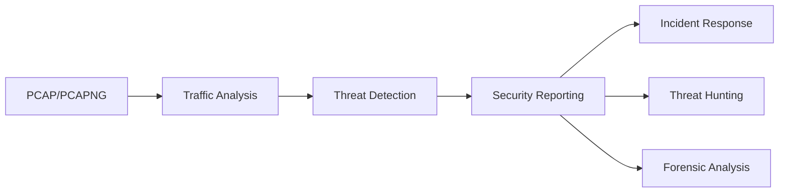

# 🦈 SharkLysis - Advanced Network Forensic Analysis Toolkit

  
*Comprehensive network traffic analysis, threat detection, and security reporting for cybersecurity professionals*

[](https://www.python.org/)
[](https://opensource.org/licenses/MIT)
[](https://github.com/kh44key/SharkLysis/issues)
[](https://github.com/kh44key/SharkLysis/commits/main)

## 🔍 Overview

SharkLysis is an advanced PCAP/PCAPNG analysis tool designed for cybersecurity professionals, incident responders, and network administrators. It goes beyond basic packet inspection to provide:

- Comprehensive network traffic analysis
- Automated threat detection
- Behavioral anomaly identification
- Professional security reporting
- Threat intelligence integration

**Ideal for**: Incident response, threat hunting, malware analysis, and network forensics.



## ✨ Key Features

### 🕵️‍♂️ Advanced Threat Detection
- **Malicious Pattern Recognition**: SQLi, XSS, C2 communications
- **Anomaly Detection**: DNS tunneling, unusual ports, beaconing
- **IoC Matching**: Custom threat intelligence integration
- **Certificate Analysis**: Malicious SSL/TLS certificate detection

### 📊 Comprehensive Analysis
- Protocol distribution statistics
- Top talker identification
- GeoIP mapping (with optional databases)
- Traffic timeline visualization
- Network communication graphs

### 📈 Professional Reporting
- Interactive console reports
- HTML reports with embedded visualizations
- Security findings prioritization (High/Medium/Low)
- Exportable graphs and charts

### ⚙️ Flexible Configuration
- Custom threat intelligence feeds
- Adjustable detection thresholds
- GeoIP database integration
- Extensible plugin architecture

## 🚀 Getting Started

### Prerequisites
- Python 3.8+
- libpcap libraries
- 4GB+ RAM (for large PCAP analysis)

### Installation

```bash
# Clone the repository
git clone https://github.com/yourusername/SharkLysis.git
cd SharkLysis

# Install dependencies
pip install -r requirements.txt

# (Optional) Install GeoIP databases
wget https://geolite.maxmind.com/download/geoip/database/GeoLite2-City.tar.gz
tar -xvzf GeoLite2-City.tar.gz --strip-components=1 -C ./
```

### Basic Usage

```bash
python sharklysis.py <path_to_pcap_file>
```

### Command Line Options
| Option | Description | Example |
|--------|-------------|---------|
| `-o OUTPUT_DIR` | Specify output directory | `-o ./reports/` |
| `-v` | Verbose mode (detailed logs) | `-v` |
| `-q` | Quiet mode (minimal output) | `-q` |
| `-t THREAT_FEED` | Custom threat intelligence file | `-t custom_iocs.txt` |
| `--geoip` | Enable GeoIP lookups | `--geoip` |

## 📊 Sample Analysis Output

### Console Report Preview
```
------------------------------ SECURITY FINDINGS -------------------------------

Suspicious IPs detected (3):
  - 192.168.1.105 (Known malicious)
  - 10.0.34.22 (Suspicious activity)
  - 185.239.242.84 (Malware C2)

Possible C2 domains detected (2):
  - malware-domain.com
  - c2-server.net

SQL injection patterns detected (12):
  - /products.php?id=1' OR '1'='1
  - /search.php?q=1 UNION SELECT...
  - /admin/login.php?username=admin'--

Weak protocols detected (TLS 1.0)
```

### HTML Report Preview


## 🛠 Configuration

Customize SharkLysis by editing these configuration files:

1. **Threat Intelligence Feeds**:
   - `iocs.txt` - Custom indicators of compromise
   - `malware_domains.txt` - Known malicious domains
   - `suspicious_ips.txt` - Known malicious IP addresses

2. **Detection Rules**:
Modify the `detect_malicious_patterns()` function in `sharklysis.py` to add custom detection rules.

3. **GeoIP Databases**:
Place `GeoLite2-ASN.mmdb` and `GeoLite2-City.mmdb` in the project root for geolocation features.

## 🗂 Project Structure

```bash
SharkLysis/
├── reports/          # Generated HTML reports
├── graphs/           # Visualization images
├── temp/             # Temporary processing files
├── sharklysis.py     # Main analysis script
├── requirements.txt  # Python dependencies
├── README.md         # Documentation
└── LICENSE           # MIT License
```

## 🤝 Contributing

We welcome contributions from the security community! Here's how to get involved:

1. **Report Issues**: Found a bug? [Open an issue](https://github.com/yourusername/SharkLysis/issues)
2. **Feature Requests**: Suggest new features or enhancements
3. **Pull Requests**: Submit code improvements
4. **Documentation**: Help improve documentation and examples

**Development Setup**:
```bash
# Create virtual environment
python -m venv venv
source venv/bin/activate

# Install development dependencies
pip install -r requirements-dev.txt

# Run tests
python -m unittest discover tests
```

## 📜 License

Distributed under the MIT License. See `LICENSE` for more information.
